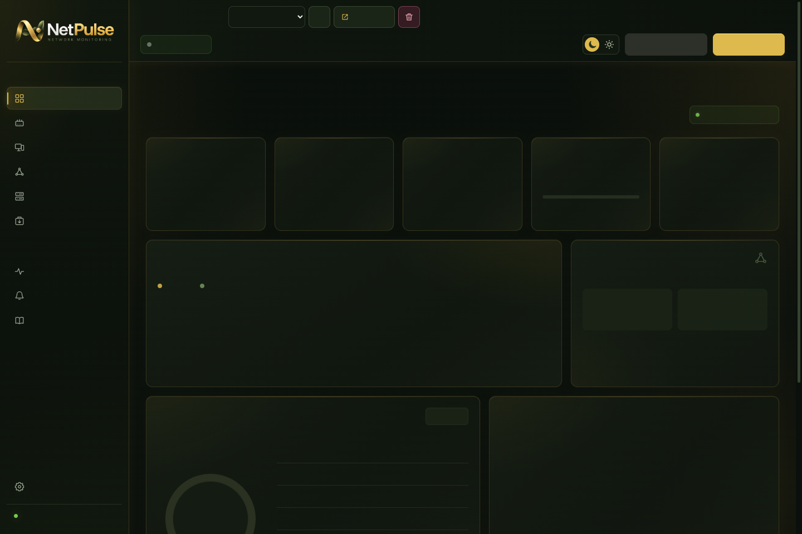
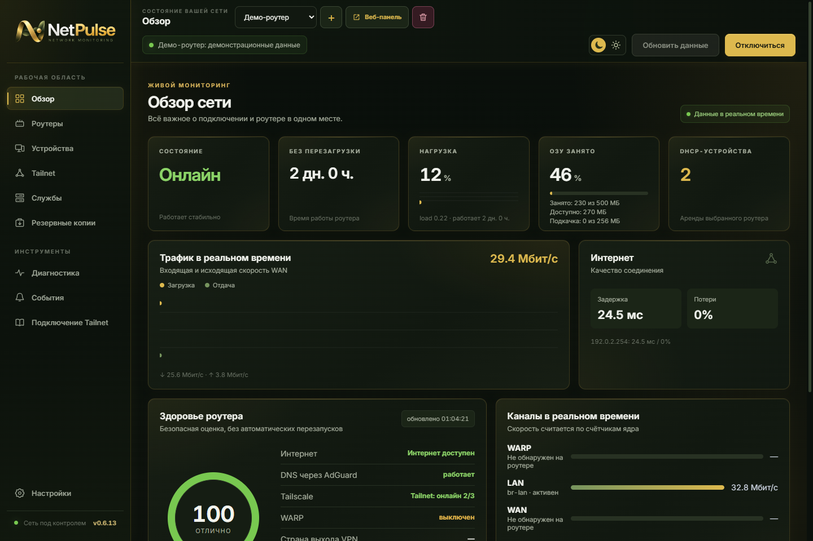
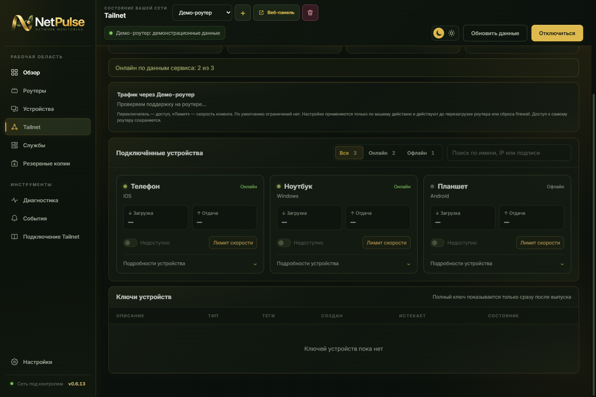
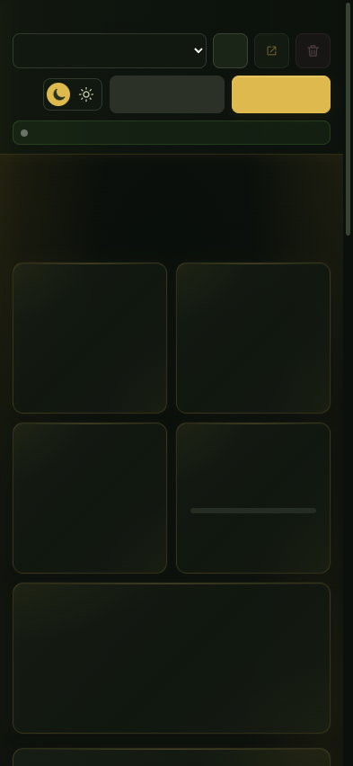
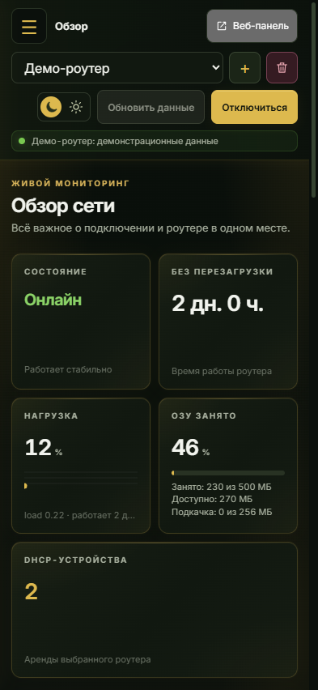

<picture>
  <source media="(prefers-color-scheme: dark)" srcset="docs/screenshots/netpulse-lockup.png">
  
</picture>

# NetPulse — сеть под контролем

Мониторинг роутеров **OpenWrt / RouteRich** на **Windows, Android и iOS**. Состояние сети, трафик, устройства, Tailnet, диагностика и резервные копии — в одном приложении.

Русский и английский интерфейс · светлая и тёмная темы · несколько роутеров · защищённое хранение паролей.

## Скачать 0.6.13

| Платформа | Скачать | Требования |
| --- | --- | --- |
| Windows | [Установщик EXE](https://github.com/yburylov/NetPulse/releases/download/v0.6.13/NetPulse_0.6.13_x64-setup.exe) | Windows 10/11, x64 |
| Android | [Приложение APK](https://github.com/yburylov/NetPulse/releases/download/v0.6.13/NetPulse_0.6.13_android.apk) | Android 8.0+, актуальный Android System WebView |
| iPhone / iPad | [IPA для личной подписи](https://github.com/yburylov/NetPulse/releases/download/v0.6.13/NetPulse_0.6.13_ios-61301-unsigned.ipa) | iOS 17+, подпись перед установкой |

[Описание выпуска и все файлы](https://github.com/yburylov/NetPulse/releases/tag/v0.6.13) · [Контрольные суммы SHA-256](https://github.com/yburylov/NetPulse/releases/download/v0.6.13/SHA256.txt) · [Инструкция по установке](docs/INSTALLATION.md)

Версия всех приложений — **0.6.13**. Android: сборка **61302**. iOS: сборка **61301**. Windows-установщик перепакован с актуальными ресурсами. Если у вас уже стоит Windows 0.6.13, эту пересборку нужно установить вручную: одинаковый номер версии не считается новым автоматическим обновлением.

Windows-установщик не подписан доверенным сертификатом издателя. Android APK подписан постоянным ключом приложения. **IPA не подписана: простое копирование на iPhone не устанавливает приложение.** Мобильные версии предназначены для личного тестирования; это не публикация в App Store или Google Play.

## Возможности

### Обзор сети

- Нагрузка процессора, оперативная память, температура и время работы роутера.
- Трафик WAN, LAN и доступных туннельных интерфейсов; выбор отображаемых каналов.
- Задержка, потери пакетов, состояние служб, системного раздела и накопителя.
- Несколько сохранённых профилей и проверка одного роутера либо всех сразу.

### Устройства и Tailnet

- DHCP-устройства домашней сети и отдельные карточки Tailnet без горизонтальной прокрутки на телефоне.
- Поиск, фильтры онлайн/офлайн, адреса, платформа, подписи и теги.
- Управление ключами подключения при наличии управляющего доступа RemoteRouteRich.
- Оценка трафика клиентов через выбранный роутер.
- Ограничение загрузки/отдачи и снятие ограничений выбранного клиента при поддержке прошивки.

Мониторинг сам не включает ограничения. Изменения выполняются только по действию пользователя. Ограничение доступа через выбранный роутер не удаляет устройство из Tailnet и не отключает другие пути подключения.

### Копии, диагностика и уведомления

- Поиск существующей резервной копии на накопителе роутера, создание новой и сохранение архива на компьютер или телефон.
- Проверка DNS с выделением результата и открытие веб-панели роутера.
- На Windows — проверка MTU текущего компьютера: поиск от 1500 байт с шагом −40; изменение только после подтверждения.
- На телефонах — проверка VPN, SSH-порта, DNS/HTTPS и сведения о размере пакетов активного интерфейса. MTU интерфейса не выдаётся за измеренный MTU всего маршрута; настройки сети не меняются.
- Журнал событий, уведомления и согласованный звук с возможностью прослушивания.
- На Windows — трей, запуск без дублирования окна и проверка обновлений.

## Как выглядит

Скриншоты показывают интерфейс с **вымышленными демонстрационными данными**. Это не пользовательская сеть; реальные адреса, личные названия, пароли и ключи не публикуются. Мобильные изображения — демонстрация в соответствующем размере экрана, не доказательство проверки каждой функции на физическом телефоне.

### Windows

### Android и iOS

 

## Первое подключение

1. В настройках добавьте адрес роутера, SSH-порт, пользователя и пароль.
2. Нажмите «Сохранить и подключиться», сверив отпечаток SSH-ключа при первом входе.
3. Для функций RemoteRouteRich укажите управляющий ключ в разделе Tailnet. Он не включён в приложение.
4. Вне дома включите Tailscale и используйте доступный адрес роутера в Tailnet или уже настроенную маршрутизацию домашней подсети.

NetPulse **не заменяет Tailscale** и не настраивает VPN автоматически. Android 61302 запоминает Tailnet-адрес после доверенного подключения и использует его первым при активном VPN. Для ограниченного поиска через панель нужны сохранённый управляющий ключ и ранее подтверждённый SSH-отпечаток; новый роутер без проверки личности не выбирается.

Если VPN подключён, но недоступны и NetPulse, и веб-страница роутера на том же телефоне, сначала проверьте состояние VPN-клиента и повторите подключение после перезапуска телефона. Это не повод автоматически менять firewall, DNS или MTU роутера.

## Важные условия

- Пароли и ключи защищаются средствами платформы: Windows, Android Keystore и iOS Keychain.
- DHCP-аренда не доказывает присутствие устройства онлайн. Скорость по счётчикам соединений — оценка; короткие соединения могут не попасть в замер.
- Для резервных копий нужен совместимый скрипт и доступное хранилище на роутере. Приложение не устанавливает их скрытно.
- Возможности управления зависят от прошивки, разрешений и firewall. Временные правила лимитов могут сбрасываться после перезагрузки роутера.
- Android: фоновый мониторинг включается отдельно и виден в постоянном уведомлении; принудительная остановка и ограничения батареи могут прекратить его работу. На iOS постоянный фоновый мониторинг и push не реализованы.
- Уведомления зависят от системных разрешений, беззвучного режима и «Не беспокоить».

[Что проверено и какие ограничения остаются](docs/VERIFICATION.md)

## Обновления и обратная связь

Windows проверяет новые версии в этом репозитории. Android обновляется APK с той же подписью, iOS — новой IPA с подходящей личной подписью. Перед обновлением не удаляйте приложение и его данные.

О проблемах сообщайте в [Issues](https://github.com/yburylov/NetPulse/issues): платформа, версия/номер сборки, шаги и ожидаемый результат. Перед отправкой скриншотов и журналов удалите личные данные, пароли и ключи.

Этот публичный репозиторий предназначен для **описания, демонстрационных материалов и готовых сборок**. Исходники приложения здесь не размещаются.
